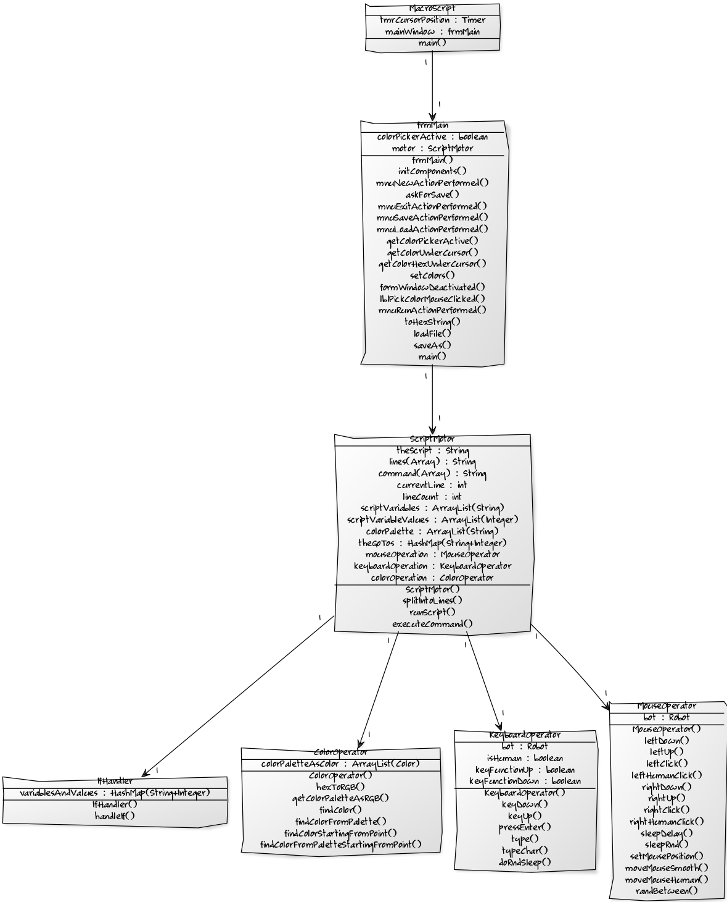

Dokumentaatio  

Toteutetaan käyttöliittymällinen, käyttäjän ohjelmoitavissa oleva macro-ohjelma, joka suorittaa tekstikenttään syötettyjä
komentoja, kuten kursorin position vaihtaminen, hiiren klikkailu, tekstin kirjoitus, ym.  

Käyttöliittymän toiminnallisuus: 
-Luo uusi skripti (ensin herjaa, että haluatko tallentaa) 
-Tallenna skripti (Buffered) 
-Avaa skripti (Buffered) 
-Suorita skripti 
-Virheilmoitusikkuna  

-Hiiren position seuraaminen timerin avulla (yhden näytön sisältävissä järjestelmissä) 
-Värin tunnistaminen kursorin alta kun toiminto on aktivoitu, lopetus kun jFrame menettää fokuksensa 
-Värin esittäminen jLabelissa 
-Värin esittäminen hex-muodossa tekstikentässä (skriptissä käytettyjen värinetsimiskomentojen vuoksi)  

Itse skriptien toiminta: 
(nimet tms. lienevät jossakin määrin eksplisiittisiä):  

if 
-Käyttötapaukset (Huom! if-lauseen toiminta rajoittuu näihin!): 
--if muuttuja=toinen_muuttuja komento 
--tai 
--if muuttuja=int_arvo komento 
--esim. if i=3 setMousePos 1 1 tai if i=j setMousePos 1 1) 
--if värinetsintäfunktio komento 
--esim. if findColor #000000 0 0 40 40 setMousePos 1 1 
--tai 
--if findColorFromPaletteStartingFromPoint #000000 20 20 100 100 60 60 setMousePos findColorFromPaletteStartingFromPoint #000000 20 20 100 100 60 60  
goto (ainoastaan esim. @-merkillä spesifioituihin kohtiin) 
sleep (odotustoiminto millisekunneissa) 
colorPalette (kirjoitusasultaan muunneltu arraylist muuttuja johon syötetään värit hex-muodossa. esim. colorPalette #000000 #FFFFFF) 
int (muuttuja) 
-esim int i 
-tai int i=3 
int muuttujien peruslaskutoimitukset, eli +, -, *, /.  

Hiiren komentoja (MouseOperator):
mouseLeftDown (hiiren vasen nappi alas) 
mouseLeftUp (hiiren vasen nappi ylös) 
mouseRightDown (hiiren oikea nappi alas) 
mouseRighUp (hiiren oikea nappi ylös) 
setMousePos (aseta kursorin sijainti) 
moveMouseSmooth (liikuttaa hiirtä taloudellisinta laskettua rataa pitkin kohdepisteeseen, voi sisältää nopeuteen vaikuttavan tekijän) 
moveMouseHuman (liikuttaa hiirtä "ihmismäisesti", eli epäsuoraa reittiä, määritettyihin koordinaatteihin ja yleensä ei osu täsmälleen syötettyihin koordinaatteihin) 
mouseLeftClick (hiiren vasen nappi alas ja ylös tehokkaimmalla tavalla) 
mouseRightClick (hiiren oikea nappi alas ja ylös tehokkaimmalla tavalla) 
mouseHumanLeftClick (ero tavalliseen on napin pohjassaoloaikaan vaikuttava satunnainen muuttuja ja painallusta edeltävä pieni pysähdys) 
mouseHumanRightClick (ero tavalliseen on napin pohjassaoloaikaan vaikuttava satunnainen muuttuja ja painallusta edeltävä pieni pysähdys)  

Näppäimistön komentoja (KeyboardOperator): 
keyDown (näppäin alas) 
keyUp (näppäin ylös) 
pressEnter (painaa enter-näppäintä)
type (kirjoittaa nopeimmalla tavalla syötteessä annetun tekstin) 
typeHuman (kirjoittaa syötteessä annetun tekstin tavalla, jossa kunkin painalluksen pohjassaoloaikaan vaikuttaa satunnainen viiveluku. Sama vaikuttaa intervalliin napin painalluksien välillä)  

Parametreinä tai if-lauseen ehtoina (ColorOperator): 
findColor (etsii näytöltä pisteen, joka on annetun syötteen värinen syötetyn Rectangle-olion koordinaattien sisältä ja palauttaa sen koordinaatit) 
findColorFromPalette (etsii näytöltä pisteen, joka on colorPalette-muuttujan sisältämän syötteen värinen, syötetyn Rectangle-olion koordinaattien sisältä ja palauttaa sen koordinaatit) 
findColorStartingFromPoint (etsii näytöltä spiraalimaisesti syötteellä määritetyn värin sisältämän pisteen annetuista koordinaateista lähtien, syötetyn Rectangle-olion koordinaattien sisältä ja palauttaa sen koordinaatit) 
findColorFromPaletteStartingFromPoint (etsii näytöltä spiraalimaisesti colorPalette-muuttujassa määritetyn värin sisältämän pisteen annetuista koordinaateista lähtien, syötetyn Rectangle-olion koordinaattien sisältä ja palauttaa sen koordinaatit)  

Erikoistapaus: 
@-merkin rivin alussa sisältävät kohdat goto-komentoa varten 

Skriptin suoritusmoottori (käy skriptin rivi riviltä läpi ja suorittaa validit komennot, ohittaen virheelliset syötteet) 
Sisältää virheiden käsittelyä jokaiselle komennolle, josta saattaa poikiintua ohjelmalle oma loggeri   

---VKO 6 Deadlinea varten uusi kuvaus---  

MacroScript on tapahtumien automatisointiin luotu ohjelma. Sen avulla voi luoda skriptejä, joita ohjelma sitten suorittaa.
Ohjelman voi laittaa tekemään toisteista työtä, esimerkiksi joidenkin taulukoiden täyttämistä. Ohjelmaa voi tietysti
käyttää myös pelien pelaamiseen. Liikkeelle ohjelma lähtee tiedostosta MacroScipt.java.  

Toiminnallisuuksien kirjoon kuuluu esimerkiksi hiiren liikuttaminen sekä vasemman että oikean napin painallukset näitä
toiminnallisuuksia hoitaa MouseOperator.java luokka.  

Näppäimistön toiminta on pääosin saatavilla ja tähän kuuluu enganninkielen aakkoset (a-z), isot ja pienet kirjaimet,
numerot, sekä suomalaisen näppäimistön mukaiset erikoismerkit (shift+numero) myös ",.-" ovat käytettävissä kuten ovat
enter ja välilyöntikin. Näitä puolestaan toteutetaan KeyboardOperator.java luokassa.  

Ohjelmaan on rakennettu toiminnallisuus, joka osaa eri tavoin etsiä värejä näytöltä. Tätä ominaisuutta voi käyttää
esimerkiksi tekstin tunnistamiseen ja peleissä vihollisten ym. tunnistamiseen. Värien etsiminen oli tehokkainta
toteuttaa niin, että piste, josta väri löytyy voidaan asettaa parametriksi jollekin komennolle (myös koko
värin löytyminen voidaan ehdollistaa, eli suoritetaan joku komento, jos väri löytyy jostain.
Värien etsinnän hoitaa luokka ColorOperator.java.  

Värinetsinnän käsitteleminen skriptissä sai suhteellisen laajuutensa vuoksi oman luokan FindColorOperator.java.  

Ohjelman ollessa skriptattava, muodostui pakollinen tarve saada skripteihin ehdollistaminen mahdolliseksi, eli toisin
sanoen if-lauseille oli pakko kehittää toiminnallisuus. Tämä sai oman luokan, IfHandler.java  

Tuntui myös oleelliselta, että ohjelman voisi saada tekemään loopia, joten goto komennolle muodostui tarve.  
Jotta looppeja voitaisiin hallita jotenkin, muodostui tarve int muuttujille
ja näistä muodostui oma luokka, jossa käsitellään siis if-lauseita ja skriptin sisäisiä int-muuttujia. Muuttujille on
käytettävissä laskutoimituksia, jotka ovat summa-, erotus-, jako- ja kertolaskut. Taas syntyy uusi luokka, VariableOperator.java.  

Käyttöliittymä sisältää kaksi luokkaa. Itse pääikkunan, jossa näytetään hiiren koordinaatit
(yhden näytös sisältävissä järjestelmissä) 10ms päivitysvälein. Ikkuna sisältää teksti kentän skriptiä varten, ikonin,
joka aktivoi värinpoimimisominaisuuden, labelin, johon väri asetellaan tarkastelua varten ja tekstikentän jossa väri
ilmoitetaan hex-muodossa. Nämä toiminnallisuudet on havaittaivissa luokassa frmMain.Java.  

Toinen käyttöliittymällinen luokka on loki-ikkuna. Siihen tulee ystävälliset ilmoitukset käyttäjälle jos hän on
kirjoittanut virheellistä skriptiä tai skriptissä on automaattisesti oikaistuja epäkohtia.   

